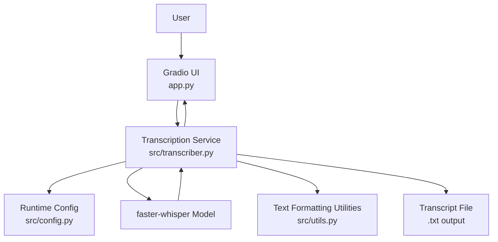
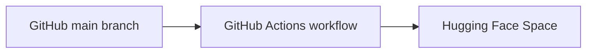

# Lecture Audio Transcriber

A production-oriented Gradio app for transcribing lecture or spoken-word audio into clean downloadable text, designed for local development and straightforward deployment to Hugging Face Spaces.

The application accepts `.mp3` and `.m4a` uploads, runs speech-to-text with `faster-whisper`, previews the result in the browser, and generates a matching `.txt` file for download. The default setup favors the multilingual `turbo` model so one deployment path can support both Indonesian and English without splitting the architecture into separate model branches.

## Overview

This repository implements a lightweight transcription workflow with a small, focused Python codebase:

- `app.py` builds the Gradio interface and handles the user interaction flow.
- `src/transcriber.py` validates files, loads the Whisper model, runs inference, and writes transcript outputs.
- `src/config.py` centralizes runtime defaults and environment-based configuration.
- `src/utils.py` formats transcript text and user-facing status messages.
- `.github/workflows/deploy_space.yml` mirrors the project to a Hugging Face Space on pushes to `main`.

The result is a simple but production-aware app that is easy to run locally, easy to review, and easy to redeploy.

## Core Idea

The core design goal is to keep transcription infrastructure simple:

- one Gradio interface for local and hosted use
- one default multilingual model for Indonesian and English
- one inference path that stays CPU-safe on Hugging Face Spaces
- optional GPU acceleration locally when CUDA is available

This keeps the application practical for portfolio use, demos, and real transcription tasks without introducing a separate backend service, database, or deployment-specific rewrite.

## Problem Statement

Many transcription demos work locally but become harder to maintain once hosted. They often depend on environment-specific setup, separate CPU/GPU code paths, or unclear deployment instructions.

This project addresses that by providing:

- a single deployment-friendly Gradio app
- predictable file validation and output handling
- graceful CPU/GPU fallback behavior
- a documented GitHub-to-Hugging-Face deployment workflow

## Key Features

- Browser-based transcription UI built with Gradio `Blocks`, suitable for both local development and Hugging Face Spaces hosting.
- Upload support limited to `.mp3` and `.m4a`, matching the validation rules enforced in the transcription service.
- Language selector with `Auto Detect`, `Indonesian`, and `English` options so users can either hint the model or rely on automatic language detection.
- Optional light cleanup that improves spacing and paragraph readability without translating, summarizing, or changing the transcript's meaning.
- Faithful transcript preview in the browser plus a downloadable `.txt` output generated from the uploaded filename.
- Cached `faster-whisper` model loading so repeated requests do not repeatedly reload the same model/device combination.
- CPU-first deployment behavior with automatic local GPU use when CUDA is available and safe fallback to CPU if GPU loading fails.
- GitHub Actions workflow for GitHub-to-Hugging-Face auto-deploy on every push to `main`.

## Technical Highlights

- **Single-path deployment strategy:** the same application code serves local development and Hugging Face Spaces hosting.
- **Inference resilience:** device detection prefers CUDA when available, but falls back to CPU automatically if CUDA is unavailable or model loading fails.
- **Runtime efficiency:** model instances are cached with `functools.lru_cache`, avoiding unnecessary reloads across requests.
- **Readable transcript shaping:** raw segment output is normalized into paragraphs based on punctuation and a configurable paragraph-length threshold.
- **Operational transparency:** the UI returns status metadata including selected language mode, detected language, model name, device used, compute type used, and fallback warnings.

## Why `faster-whisper`

`faster-whisper` is a practical fit for Spaces because it is efficient, widely used for Whisper-based transcription, and supports both CPU and GPU runtimes with the same application code. That keeps deployment simpler than maintaining separate local and hosted inference paths.

## Why multilingual `turbo` is the default

The `turbo` model is the recommended default here because it gives one multilingual path for Indonesian and English, keeps the UX simple, and avoids the maintenance overhead of switching between separate language-specific models. For this app, the cleanest production setup is one default model with optional language hints rather than branching the architecture early.

## Tech Stack

| Layer | Technology |
| --- | --- |
| Language | Python 3.10+ |
| UI | Gradio `Blocks` |
| Speech-to-Text | `faster-whisper` |
| Inference Runtime | Whisper model execution with CTranslate2-backed runtime via `faster-whisper` |
| Configuration | Environment variables in `src/config.py` |
| File Output | Local filesystem transcript export as `.txt` |
| CI/CD | GitHub Actions |
| Deployment Target | Hugging Face Spaces (Gradio SDK) |
| Tooling | `pip`, virtual environments, Git |

## System Architecture

At runtime, the app is a compact three-layer flow: Gradio handles interaction, the transcription service handles validation and inference orchestration, and the model runtime produces transcript segments that are formatted and written to disk.



Deployment is equally direct:



## How the System Works Internally

1. A user uploads an `.mp3` or `.m4a` file and chooses a language mode plus optional cleanup.
2. `run_transcription()` in [`app.py`](app.py) passes the request into `transcribe_audio_file()` in [`src/transcriber.py`](src/transcriber.py).
3. The service validates that the file exists, is non-empty, and matches the supported extensions.
4. CUDA availability is checked through `ctranslate2`; if available, the app attempts a GPU model load, otherwise it uses CPU.
5. Model loading is cached by model name, device, and compute type so later requests reuse an already-loaded model when possible.
6. The model transcribes with the configured defaults:
   - `beam_size=5`
   - `best_of=5`
   - `vad_filter=True`
   - `condition_on_previous_text=True`
   - `temperature=0.0`
   - `word_timestamps=False`
7. Segment text is normalized into paragraphs, optionally cleaned for spacing and line-break readability, then written to a `.txt` file.
8. The UI returns three outputs: transcript preview, transcript download path, and a structured status panel.

## Project Structure

```text
project-root/
├── app.py                          # Gradio entrypoint and UI event wiring
├── requirements.txt                # Runtime Python dependencies
├── README.md                       # Project and Hugging Face Space documentation
├── .gitignore                      # Ignored caches, virtualenvs, and transcript outputs
├── src/
│   ├── __init__.py
│   ├── config.py                   # Defaults, environment variables, transcription settings
│   ├── transcriber.py              # Validation, model loading, inference, transcript export
│   └── utils.py                    # Text cleanup, paragraph formatting, status rendering
└── .github/
    └── workflows/
        └── deploy_space.yml        # GitHub Actions auto-deploy to Hugging Face Spaces
```

## Getting Started

### Prerequisites

- Python `3.10` or newer
- `pip`
- A virtual environment tool such as `venv`
- Internet access on first transcription request so the default Whisper model can be downloaded if it is not already cached
- Optional: a local CUDA-capable GPU for acceleration

### Installation

Clone the repository, create a virtual environment, and install dependencies:

```bash
git clone <repository-url>
cd personal-audio-transcriber
python -m venv .venv
source .venv/bin/activate
pip install -r requirements.txt
```

If you already have the repository locally, only the environment creation and `pip install` steps are required.

### Environment Variables

The repository does not currently include a `.env.example` file. Configuration is read directly from environment variables in [`src/config.py`](src/config.py).

| Variable | Description | Default | Required |
| --- | --- | --- | --- |
| `WHISPER_MODEL_NAME` | Whisper model name passed to `faster-whisper` | `turbo` | No |
| `WHISPER_CPU_COMPUTE_TYPE` | Compute type used for CPU inference | `int8` | No |
| `WHISPER_GPU_COMPUTE_TYPE` | Compute type used for GPU inference | `float16` | No |
| `TRANSCRIPT_OUTPUT_DIR` | Directory where generated `.txt` transcripts are written | OS temp directory + `/transcripts` | No |
| `MAX_PARAGRAPH_CHARS` | Paragraph length threshold used when joining transcript segments | `900` | No |

For GitHub-based deployment, one additional secret is required:

| Variable | Description | Required |
| --- | --- | --- |
| `HF_TOKEN` | GitHub repository secret used by the deployment workflow to push to the Hugging Face Space | Yes, for auto-deploy only |

### Running the Project Locally

Start the Gradio app:

```bash
python app.py
```

Gradio will print the local URL in the terminal. On the first transcription request, `faster-whisper` may download the `turbo` model weights if they are not already cached.

### Local Runtime Notes

- The app queue is enabled with a default concurrency limit of `1` and a maximum queue size of `8`.
- Transcript files are written outside the UI component lifecycle, then returned as downloadable file outputs.
- By default, transcripts are written to a temp directory rather than stored in a database.

## Usage Guide

1. Launch the app with `python app.py`.
2. Open the local Gradio URL in your browser.
3. Upload an `.mp3` or `.m4a` file.
4. Choose one of these language modes:
   - `Auto Detect`
   - `Indonesian`
   - `English`
5. Optionally enable **Light cleanup for readability**.
6. Click **Transcribe**.
7. Review the transcript preview, inspect the status panel, and download the generated `.txt` file if needed.

The transcript flow is intentionally faithful to the original audio. The app does not translate the content, summarize it, or reword it into notes.

## API Surface

This repository does not implement a separate REST API, database-backed backend, or authentication layer.

Instead, the backend execution path is managed by Gradio event handlers in [`app.py`](app.py). The transcription action is registered with `api_name="transcribe"`, which means the app exposes the transcription operation through Gradio's own request handling rather than a custom API module.

## Deployment

### Hugging Face Spaces

This repository is already structured for a Gradio Space:

- `app.py` is the main entrypoint.
- `requirements.txt` declares runtime dependencies.
- The README metadata block at the top matches Hugging Face Spaces expectations.

To deploy directly to Hugging Face Spaces:

1. Create a new Space on Hugging Face.
2. Choose `Gradio` as the SDK.
3. Push this repository into that Space repository, or use the GitHub Actions workflow described below.

This app is intentionally CPU-compatible by default. If the Space has no GPU, the code falls back to CPU automatically and uses an `int8` compute path to stay practical for Spaces environments.

### GitHub to Hugging Face Auto-Deploy

The repository includes [`.github/workflows/deploy_space.yml`](.github/workflows/deploy_space.yml), which mirrors your `main` branch to a Hugging Face Space whenever you push updates.

The current workflow is configured with:

```text
TsukishimaAlan20/personal-audio-transcriber
```

If you want to deploy to a different Space, update the `HF_SPACE_ID` value in the workflow.

#### Setup

1. Create a Hugging Face Space.
2. Create a Hugging Face write token with permission to push to that Space.
3. In your GitHub repository, add a repository secret named `HF_TOKEN`.
4. Open [`.github/workflows/deploy_space.yml`](.github/workflows/deploy_space.yml) and set `HF_SPACE_ID` to:

```text
YOUR_HF_USERNAME/YOUR_SPACE_NAME
```

5. Push to the `main` branch.

#### How the GitHub Action works

On each push to `main`, the workflow:

1. checks out your GitHub repository
2. configures the GitHub Actions bot identity
3. clones the Hugging Face Space repository using `${{ secrets.HF_TOKEN }}`
4. syncs the project files into the cloned Space repository with `rsync`
5. commits only if changes exist
6. pushes the update to Hugging Face Spaces

### Manual Deployment Alternative

If you do not want to use GitHub Actions, you can push directly to the Hugging Face Space repository:

```bash
git remote add space https://huggingface.co/spaces/YOUR_HF_USERNAME/YOUR_SPACE_NAME
git push space main
```

If the Space requires authentication, use a Hugging Face token with write access when Git prompts for credentials.

### CPU-First Deployment Notes

- The default hosted path is CPU-safe.
- Local GPU use is automatic only when CUDA is available.
- If a GPU model load fails, the app falls back to CPU and reports that in the status panel.
- First-run model download time on Spaces is normal and should be expected.

## Screenshots / Demo

> Screenshots or demo media can be added here to showcase the application interface and end-to-end transcription workflow.

## Testing

No automated tests are included in the repository at the moment.

For now, the practical validation path is a manual smoke test:

1. run `python app.py`
2. upload a short `.mp3` or `.m4a` sample
3. verify transcript preview, status output, and `.txt` download behavior
4. if relevant, verify both CPU-only and local GPU-assisted execution paths

Adding automated tests for file validation, utility formatting, and transcription-service error handling would be a strong next improvement.

## Troubleshooting

### The app starts but transcription fails

- Check the Space logs for model download, decode, or runtime errors.
- Confirm the uploaded file is actually `.mp3` or `.m4a`.
- Retry with a shorter sample if the original recording is unusually large or corrupted.

### The first request is slow

The first transcription request may need to download model files and warm the runtime cache.

### Deployment from GitHub does not work

- Confirm the `HF_TOKEN` GitHub secret exists.
- Confirm the token has write access.
- Confirm `HF_SPACE_ID` in the workflow matches the actual `username/space-name`.

## Development Workflow

- Keep runtime dependencies aligned with `requirements.txt`.
- Iterate locally with `python app.py`.
- Push to `main` when you want the configured GitHub Actions workflow to redeploy the Space.
- Keep large raw audio files and generated transcripts out of version control.

## Engineering Notes

- The app uses a small, service-oriented structure instead of putting all logic directly into the Gradio UI layer.
- Transcript filenames are sanitized and timestamped before being written to disk.
- Status output is intentionally explicit so hosted users can see whether CPU fallback or GPU load issues occurred.
- The current implementation is optimized for transcription simplicity, not multi-user horizontal scale.

### Build reliability notes

- Avoid committing large raw audio files to the repository.
- Avoid adding unnecessary heavyweight dependencies unless you also validate the Hugging Face build path.
- Keep generated transcripts out of version control.

## Roadmap

Reasonable next improvements for this repository include:

- add automated tests for validation, formatting, and failure cases
- support more audio input formats when there is a clear need
- expose advanced transcription options such as timestamps or model selection in the UI
- add example media, screenshots, or a short demo GIF for presentation quality
- document environment setup with a `.env.example` file if configuration grows

## Contributing

Contributions are easiest to review when they stay focused and deployment-aware.

1. Create a feature branch.
2. Make the smallest coherent change set possible.
3. Test locally with `python app.py`.
4. Update documentation when behavior, configuration, or deployment changes.
5. Open a pull request with a clear summary of what changed and why.

## License

No license has been specified yet.
